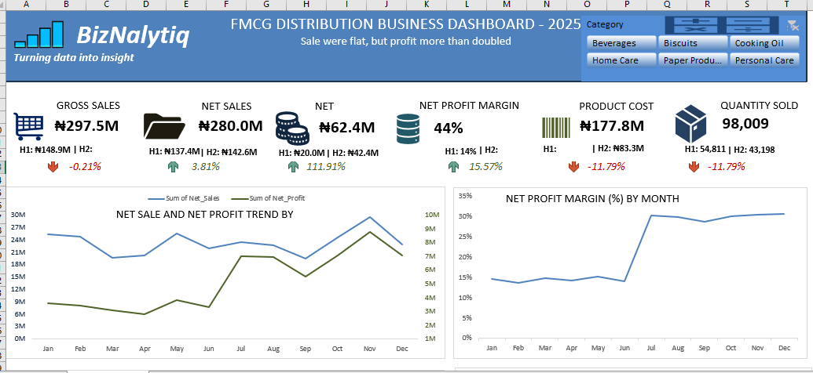
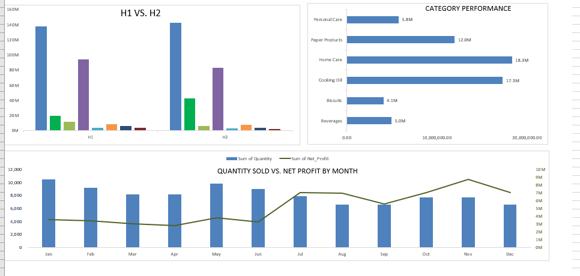

# FMCG Profitability Analysis

## How Can Profit Increase When Sales Are Flat?

An Excel-based business analytics case study investigating how profitability can improve even when sales performance is relatively flat.

## Business Problem

A business can generate strong sales without generating strong profit. This analysis investigates a more interesting situation:

> **What happens when sales remain relatively flat, but net profit increases significantly?**

The objective is to identify the factors behind the change and translate the findings into practical business recommendations.

## Objective

The analysis focuses on:

- Revenue and net sales performance
- Net profit and profit margin
- Discounts
- Product costs
- Operating costs
- Sales volume
- Product profitability
- H1 vs H2 performance

## Dataset

The analysis uses business data from a real FMCG company.

The company's actual name and identifying details have been withheld for privacy and confidentiality, so **"FMCG"** is used as a generic name.

The data is presented for business analysis and learning purposes.

## Tools Used

- Microsoft Excel
- Excel Tables
- PivotTables
- PivotCharts
- Slicers
- Conditional Formatting
- Excel formulas
- KPI analysis
- Business performance analysis

## Key KPIs

| KPI | H1 | H2 | Change |
|---|---:|---:|---:|
| Gross Sales | ₦148.89M | ₦148.58M | -0.21% |
| Net Sales | ₦137.40M | ₦142.64M | +3.81% |
| Net Profit | ₦20.01M | ₦42.40M | +111.91% |
| Net Profit Margin | 14.56% | 29.72% | +15.16 pp |
| Discount Rate | 7.72% | 4.00% | -3.72 pp |
| Product Cost % | 68.77% | 58.43% | -10.34 pp |
| Quantity Sold | 54,811 | 43,198 | -21.19% |

## Key Findings

### 1. Sales were relatively flat

Gross sales changed by only **-0.21%** between H1 and H2.

However, net sales increased by **3.81%**, indicating that the business retained more revenue after discounts.

### 2. Profit increased significantly

Net profit increased from approximately **₦20.01M in H1 to ₦42.40M in H2**, representing an increase of approximately **111.91%**.

### 3. Profit margin improved substantially

Net profit margin increased from **14.56% to 29.72%**.

This means the business converted a much larger proportion of its net sales into profit during H2.

### 4. Discounts became more controlled

The discount rate decreased from **7.72% to 4.00%**.

Lower discounting helped the company retain more revenue from its sales.

### 5. Product cost efficiency improved

Product cost as a percentage of net sales decreased from **68.77% to 58.43%**.

This indicates a significant improvement in the relationship between product costs and revenue.

### 6. Profit increased despite lower sales volume

Quantity sold decreased by **21.19%**, while net profit increased by **111.91%**.

This shows that profitability was not driven simply by selling more units.

The business became more profitable through improved margins and cost efficiency.

## Business Interpretation

The analysis suggests that the improvement in profitability was driven primarily by:

1. Lower discounting
2. Improved product cost efficiency
3. Better overall cost control
4. Improved profit margins
5. Stronger profitability from the sales mix

This demonstrates why revenue alone should not be used to evaluate business performance.

## Recommendations

Based on the analysis, management should:

- Maintain disciplined discounting.
- Monitor product costs as a percentage of sales.
- Identify and prioritize high-margin products.
- Continue negotiating supplier and operating costs.
- Monitor profit margin alongside revenue.
- Track sales volume separately from profitability.
- Review the sustainability of the improved margins.

## Dashboard

The Excel dashboard provides an interactive view of:

- Revenue performance
- Net profit
- Net profit margin
- H1 vs H2 performance
- Cost structure
- Product profitability
- Monthly performance

*The dashboard is presented in two parts for clearer visualization.*

## Project Files

### Dataset

`data/FMCG_Transactions.xlsx`

### Dashboard

`dashboard/FMCG_Profitability_Dashboard.xlsx`

## Conclusion

This case study demonstrates an important business analytics principle:

> **Higher sales do not always mean higher profitability.**

By analyzing revenue, discounts, costs, margins and product performance together, businesses can identify the real drivers of profitability and make better decisions.

---

**Created by BizNalytiq**

Business Analytics | Finance | Strategy
